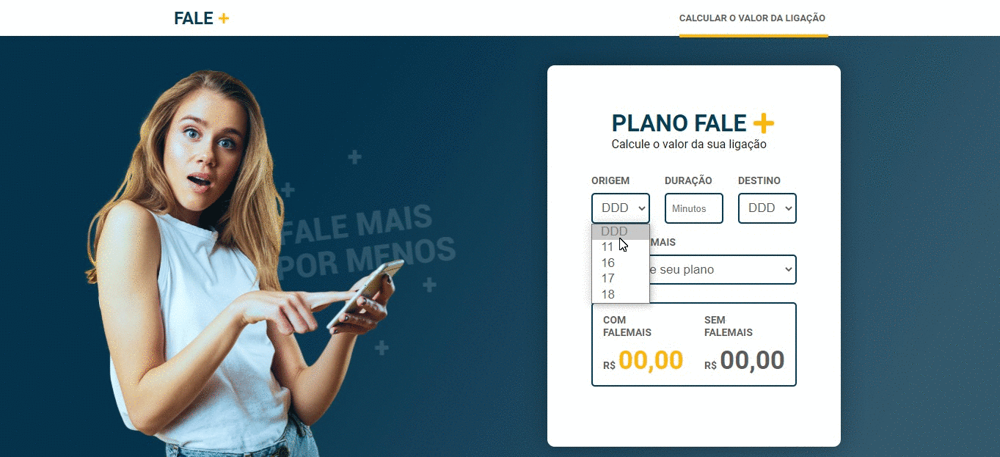

<h1  align="center">

</h1>

<p  align="center">
<a  href="#telescope-projeto">🔭 Projeto</a>&nbsp;&nbsp;&nbsp;|&nbsp;&nbsp;&nbsp
<a  href="#computer-tecnologias"> 💻 Tecnologias</a>&nbsp;&nbsp;&nbsp;|&nbsp;&nbsp;&nbsp;
<a  href="#-preview">💜 Preview</a>&nbsp;&nbsp;&nbsp;|&nbsp;&nbsp;&nbsp;
<a  href="#-getting-started">🤠 Getting Started </a>
</p>

## :telescope: Projeto

Projeto desenvolvido como teste de conhecimento para o processo seletivo da LOLDESIGN Soluções Web.

## :computer: Tecnologias

- React

- NodeJS

## 💜 Preview

<p  align="center">

</p>

## 🤠 Getting Started

Você precisa clonar o repositório digitando em seu terminal `$ git clone https://github.com/lucaslds94/FaleMAIS.git`.

### :satellite: Backend

- Navegue até a pasta backend `$ cd backend/` e execute o comando `yarn install` ou `npm install`.

- Após as dependências forem instaladas, execute o comando `yarn start` ou `npm start`. Apresentando assim, a mensagem abaixo em seu terminal.

```

[SERVER] Server running on port 3333

```

> Caso deseje realizar os testes, execute `$ yarn test` ou `$ npm test`. Assim, será exibido em seu terminal o resultado dos testes.

<br>

**:crystal_ball: Web**

Após seguir os passos anteriores, vá até a pasta `$ cd web/` e execute `$ yarn install` ou `$ npm install`.

Depois das dependências serem instaladas, execute o comando `$ yarn start` ou `$ npm run start`. Assim, a página será aberta em seu navegador padrão.

---

<h5 align="center"> FaleMAIS by Lucas Lima </h5>

---
